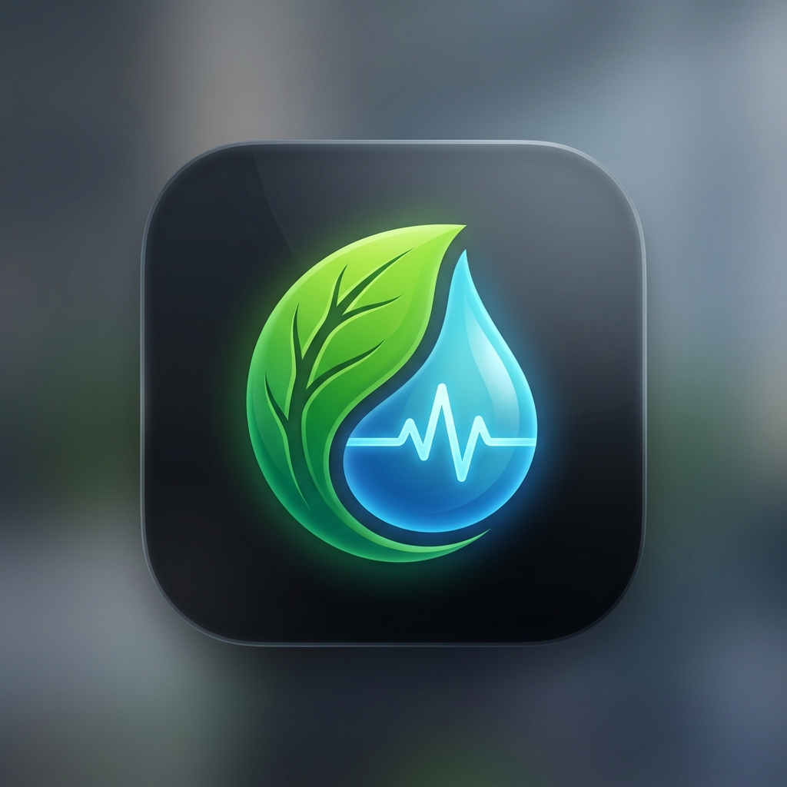

# 🌿 Smart Plant for Home Assistant

**Smart Plant** je moderní integrace pro Home Assistant, která vám pomůže s péčí o vaše pokojové rostliny. Na rozdíl od jiných řešení se Smart Plant automaticky napojuje na encyklopedii **OpenPlantbook**, ze které čerpá data o nárocích rostlin, obrázky a tipy pro pěstování.

## ✨ Klíčové vlastnosti

- **Automatické doplňování**: Stačí zadat název rostliny a integrace sama dohledá její latinský název, obrázek a potřeby.
- **Inteligentní intervaly**: Automatický výpočet frekvence zalévání na základě biologických nároků konkrétního druhu.
- **Encyklopedické tipy**: Senzor s radami ohledně ideálního světla, teploty a vlhkosti.
- **Sledování historie**: Přehled o posledních zaléváních a vývoji zdraví rostliny.
- **Krásné UI**: Navrženo pro snadné použití s dashboardovými kartami (např. `simple-plant-card`).

## 🚀 Instalace

### Přes HACS (Doporučeno)
1. Otevřete HACS v Home Assistant.
2. Klikněte na tři tečky vpravo nahoře a vyberte **Custom repositories**.
3. Vložte URL tohoto repozitáře a vyberte typ **Integration**.
4. Klikněte na **Stáhnout**.
5. Restartujte Home Assistant.

### Manuální instalace
1. Stáhněte si obsah složky `custom_components/smart_plant`.
2. Zkopírujte ji do složky `/config/custom_components/smart_plant` ve vaší instalaci Home Assistant.
3. Restartujte Home Assistant.

## ⚙️ Nastavení

1. Běžte do **Nastavení -> Zařízení a služby -> Přidat integraci**.
2. Vyhledejte **Smart Plant**.
3. Zadejte své API údaje z [OpenPlantbook API](https://open.plantbook.io/) (zdarma).
4. Přidejte své rostliny vyhledáváním v databázi.

## 🛠️ Entity

Pro každou rostlinu získáte:
- `binary_sensor.*_needs_water` - Indikace potřeby zalití.
- `sensor.*_next_watering` - Datum příštího zalévání.
- `sensor.*_care_tips` - Tipy k péči a ideální podmínky.
- `button.*_mark_watered` - Tlačítko pro potvrzení zalití.
- `image.*_picture` - Automaticky stažený obrázek rostliny.
- ...a další (zdraví, interval, poslední zalití).

---

Vytvořeno s ❤️ pro milovníky rostlin.
